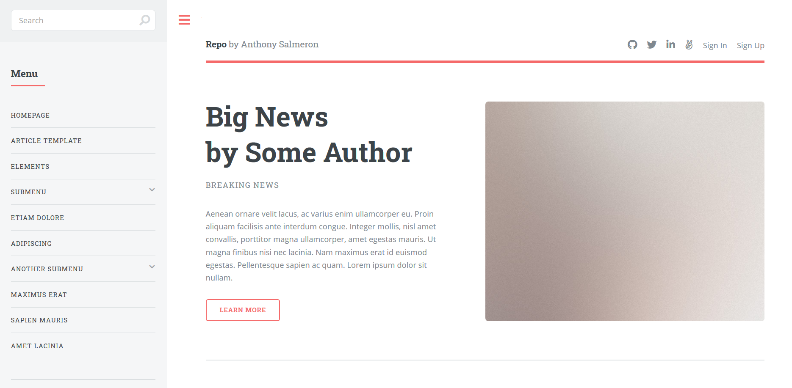

# DemoDay
Link: https://sheltered-ridge-28038.herokuapp.com/

# Installation

1. Clone repo
2. run `npm install`
3. Make config folder to store your personal credentials, this will be Azure, mailer, MongoDB database, and passport configurations

# Usage

1. run `node server.js`
2. Navigate to `localhost:4000`

# Core Technologies Used
- EJS
- CSS 
- JS
- NodeJS
- MongoDB, Mongoose
- Azure Cognitive Services(machine learning for text analytics and keyword extraction)
- Azure Storage Blobs
- ML5.js image classification ML model

## How it Works:
# Main Page: 
- Landing page is an introduction to the type of content you expect to see on the website. When the call is made to the server to render it, the server takes from the database a list of the top 7 most viewed articles and displays them along with their corresponding pictures. 
- The content is actually stored in text files within blob storage so to read their content, some javascript is needed on this page. One of the things passed to the ejs is an array of objects with information from the database, it includes titles, keywords, and most importantly, the url location of the stored assets. Images can be directly loaded from this but to load a text doc, we first load the url on to the page in a P tag with a class of getText. Then with javascript, we gather all of the elements with that class, record all of their url links, and make fetch requests to Azure that will get back readable streams of data.
We decode that data with the built in TextDecoder, it'll all be in one chunk. We then plug that chunk right back in to the location from where we took the url. Each article section also has links that will perform a search operation to find the full article if they are clicked.
- When a user is logged in, the operations on this page are slightly different. Instead of taking the most popular articles, the results are tailored specifically to the reading history of the user, more on that in the miscellaneous section below.
# Sidebar
- Top of sidebar is a search input section, when a user presses enter, it will tell the server to run a search through the database. To facilitate this, we use a fuzzy search module called Fuze which allows some leeway in spelling and grammar in order to comb through the database. 
- It will search through titles, keywords, authors, dates, and machine learning keywords(more on that later) to determine possible matches. It will only returns matches which have a decent possibility of being correct (based on a match percentage algorithm) and will order the returns from most to least likely. 
- These matches will then be passed to a "search" ejs page which will render the articles that match the query, as well as links to get their full text. Below this is the navigation which takes the user through different search categories, their profile page, and the main page of the website. 
- Each of the categorical navigation tabs will use the same search route as the general search from above but will include a "category" search parameter. They will search through specific categories in the database and render in the "search" ejs page the top eleven matches for the query based on popularity. 
# Profile
- On the profile page, the first things that render are two select inputs; one for deleting interests (that you specified in signup), and one for adding them. 
- The way they work is if they are changed (onchange), a function runs that will take the selected value and use a fetch request to either delete or add the selected item to the user profile in the database. When this operation is done the page refreshes. 
- Something that might appear based on situation is a loader which indicates that the user will be able to upload (when the loader animation stops). As for the uploading, the way it works in this application is that articles must be peer reviewd to be eligible for viewership and download that. In this environment, they will be peer reviewed by people who have interests that match up with the initial categorization of the uploaded files. 
- While there are articles to be reviewed, that haven't been uploaded by the user, that match the user's interests, and the user hasn't sent in a review yet, a form will appear that will have the full article, a link to be able to download the article, and a textarea that will contain the user's review. 
- When the review is sent in, instead of manually reviewing each review, we can use Azure's pre-trained ML models to analyze the text. They can analyze the text and extract keywords, which we can store in the database as descriptors for the article, and they can perform sentiment analysis on the review so as to determine whether we should keep the article or not. What this looks like in the server is first a delete operation on the item in question, the articles that were in the proposal stage are deleted from a "proposal" database regardless of the review being positive or negative.
- If the review is negative, we use an Azure module to go into blob storage and delete the files that correspond to the deleted MongoDB document, then the user is redirected to the profile page without articles to review. If the review is positive, the result of the delete operation(a copy of the deleted document) is added to the "peer-reviewed" collection. Then the item in question has its machine learning keywords field appended by the returns of the keyword extraction operation that Azure performed. 
- The user is then redirected to the profile page but without articles to review this time. When a user loads the profile page and there are no articles to review, a script runs that enables the loader and then begins loading an image classification model called MobileNet. 
When it's done loading, that same script shuts off the loader to let the user know they can use the page. 
- Instead of there being a review form, another form is loaded that allows the user to input an article, an accompanying image, a title, category tags, and an author. Also, the previously loaded ML image classification model is used here. When an image is input, browser side javascript will be used to read its data and display the image in the DOM, as well as use the classifier to give three possible matches for the image. 
- If the user thinks any of them are applicable, they can select one or more of the three to be part of the machine learning classification keywords that are part of the doc in the database. At the bottom of the page is another experimental feature, a random emailer. It's a button that when pressed will send a random article from the database to the user's email. 
- In the future for this page I hope to begin retraining the model with user input, as it stands, it can only classify about 1000 objects and a dedicated user base could greatly increase its classification accuracy. Also I hope to integrate some sort of mailing list in to the app based around the nodemailer module that powers the random email function.
# Miscellaneous 
- The popularity of each article is judged by the visits to their specific "page." In truth, the way it works is each time the search route is queried with a specific id, the id of a given article, along with serving back the article, the server will update the popularity score in the database. 
- The way the articles that show for a specific user are chosen is based on information on the user document that tracks how much time a user has spent in each category of articles. When a single article is displayed on a page and there is an active user on the page, the category keys for that article are put on to the page but they're given a display of none so the user isn't able to see them. Background JS runs that will collect these keys and use them to make a Fetch request to the server every five seconds. This request increments those specific keys in the database for the request user. When the main page is loaded, the top three categories in terms of time spent on them are the ones that are used to search through the database and pull for the user.
- Throughout the code, there are extra options available to people for if they want to deviate from the methologies I used. For example, instead of making a delete request to Azure with their module, I included an optional axios based method to make the request. Or for storage, I left in code that could be used to connect to Amazon S3 instead or a local storage option.
- The way to prevent files from being named the same thing is to append a number to the filenames. This number is a product of a Math.random() operation and the moment in time when the function is called to name them. 
- # Technologies that I have become familiar with through this project: Prerender, Amazon S3, Axios, readable streams, email integration, fuzzy searches using modules and Regex, cloud service ecosystems

